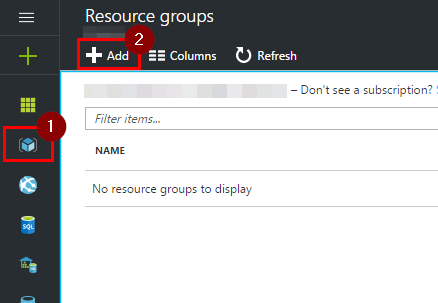
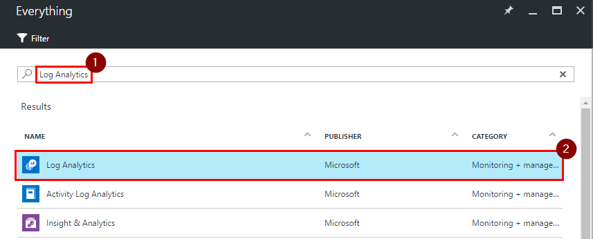
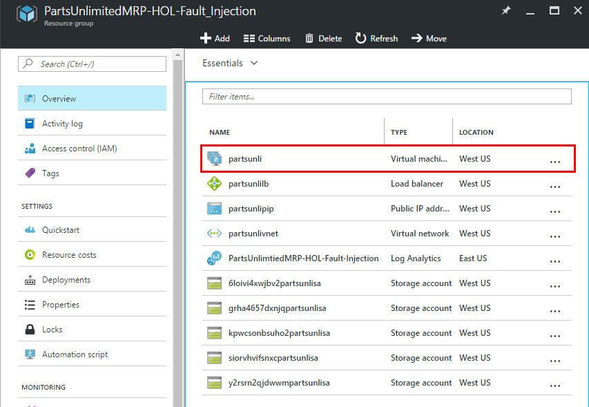
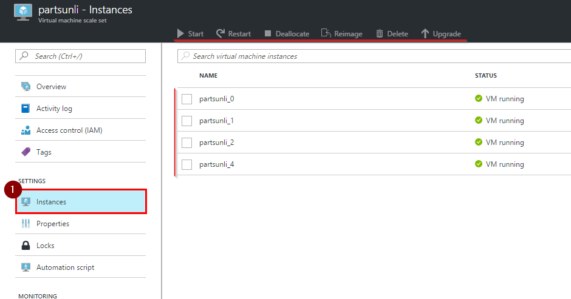
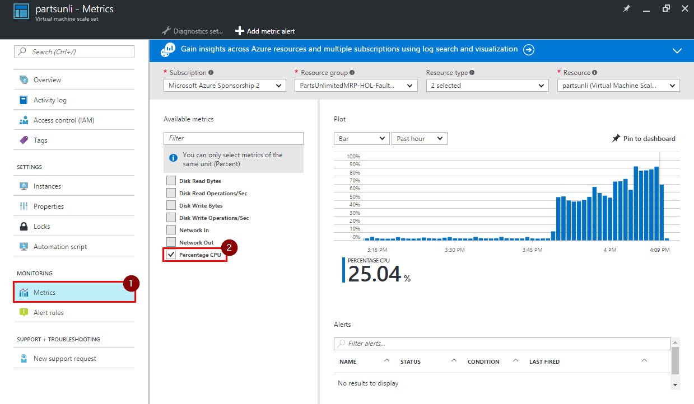
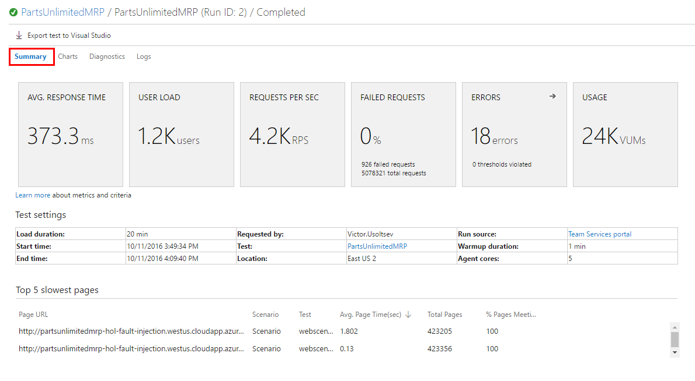
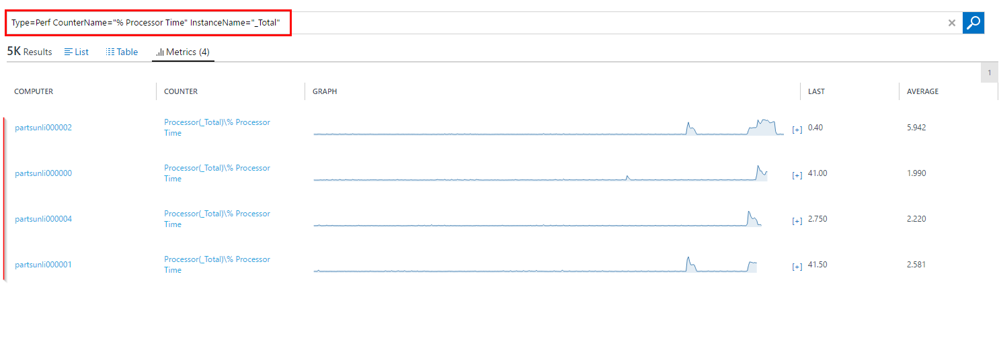

HOL - Fault Injection for Azure IaaS with OMS
=============================================

In this lab you will set up PartsUnlimitedMRP's environment hosted on multiple VMs in Virtual Machine Scale Set (VMSS) for better reliability. Operations Management Suite(OMS) will be used to monitor how this environment handles VM failures under the load. Excepted number of user for this system is 1200 people.

## Pre-requisites:

* Azure account with a subscription

* VSTS account


## Tasks Overview:
**1. Setup OMS workspace** This task will show you how to create OMS Workspace using Azure and then find WORKSPACE ID and PRIMARY KEY used to connect to OMS.

**2. Deploy ARM template** In this task you will deploy an ARM template which creates a VMSS of Linux machines and then installs MRP environment on it.

**3. Set up Load Test** In this task you will configure a load test using VSTS.

**4. Inject faults into VMSS** In this task you will learn how to inject faults into VMSS using Azure Portal, PowerShell script or [Chaos-Dingo](https://github.com/jmspring/chaos-dingo).

**5. Analyze load test's results.** In this task you will collect the information related to the load test and fault injection and then analyze it.


## HOL:
###Task 1: Setup OMS workspace

**Step 1.** Open Azure and create a new resource group for this HOL.

1. Click on "Resource groups" icon, then on "+ Add".

    

2. Enter a name for your resource group, pick a subscription, select a location and click on "Create".

    


**Step 2.** Add "Log Analytics" to this resource group.

1. Open the new resource group and click on "+ Add" button on the "Overview" page to add a new resource.

      

2. Filter resources by typing "Log Analytics" into the search bar, press "Enter", click "Log Analytics" and click on "Create" button.

      

3. Create an OMS workspace. Enter name, pick a subscription, location, current resource group and a pricing tier then click on "OK" button.

      
    >**Note:** OMS Workspace name has to be unique across Azure.

**Step 3.** Get "Workspace ID" and "Primary Key" from OMS Portal.

1. Navigate to your resource group and click on "Log Analytics" you just created.

2. Click on "OMS Portal".

      

3. Once OMS portal has loaded, click on "Settings".

      

4. Click on "Connected Sources", then "Linux Servers" and note the "WORKSPACE ID" as well as the "PRIMARY KEY".

    

**Step 4.** To set up collection of metrics click on "Data", "Linux Performance Counters", "Add the selected performance counters" and then on "Save".

 


###Task 2: Deploy ARM template
This task will setup the required environment in Azure.

**Step 1.** Click on "Deploy to Azure" button below.

[](https://ms.portal.azure.com/#create/Microsoft.Template/uri/https%3A%2F%2Fraw.githubusercontent.com%2FIntergen-NZ%2FPartsUnlimitedMRP%2Ffeature%2Ffault-injection-iaas%2Fdocs%2FHOL_Fault-Injection-for-Azure-IaaS-with-OMS%2Fenv%2Ftemplate%2FlinuxVirtualMachineScaleSet.json)
[](http://armviz.io/#/?load=https%3A%2F%2Fraw.githubusercontent.com%2FIntergen-NZ%2FPartsUnlimitedMRP%2Ffeature%2Ffault-injection-iaas%2Fdocs%2FHOL_Fault-Injection-for-Azure-IaaS-with-OMS%2Fenv%2Ftemplate%2FlinuxVirtualMachineScaleSet.json)


**Step 2.** Select Azure Subscription and the resource group you created earlier. Fill in Settings section.

  * "Vmss Name" should be a unique alpha-numeric name across Azure.
  * Set "Instance Count" to 4.
  * Admin username and passwords are the credentials for your virtual machines.
  * Enter "Oms Workspace Id and the "Oms Primary Key" you took a note of in OMS Portal earlier.

    

**Step 3.** Reed and agree with terms and conditions, then click on "Purchase".

    

> **Note:** The deployment might take up to 10 minutes.

**Step 4.** Once deployment has finished verify that MRP solution is being hosted and that all 4 machines connected to OMS.

1. Navigate to your resource group and click on "Virtual Machine Scale Set" instance.

      

2. Note the Public IP address of your VMSS.

      

3. Open `<public IP address>/mrp` in a browser. This will take you to MRP solution.

      

4. Now, refresh OMS Portal and you should see that now it's 6 instances connected to the OMS, 4 of which are active in Azure and 2 are disabled.

      


###Task 3: Set up Load Test

**Step 1.** Open your project in VSTS. Click on "Test", "Load test", "New", then on "URL based test".

  

**Step 2.**  Enter a name for this load test and then enter the URL to MRP page hosted in your VMSS.

  

>**Note:** <br> 1) URL should be in the following format: `http://<name>.<region>.cloudapp.azure.com/mrp` <br> 2) DNS name of the VMSS can be found by navigating to your resource group and clicking on "public IP address" instance.
  

**Step 3.**  Add another request by clicking on "Add URL" and then entering URL in the following format:

    http://<dns name>:8080/catalog

  

**Step 4.**  Switch to "Settings" tab, fill out fields as follows and then click on "Save":

  * Run duration (minutes): 20
  * Max v-users: 1200
  * Warmup duration (seconds): 60

  

**Step 5.**  Familiarize yourself with the next task, set up a tool you are going to use for injecting faults, then click on "Run test".

  

> **Note:** Make sure you familiarize yourself with the costs associated with load testing ([Visual Studio Team Services Pricing](https://azure.microsoft.com/en-us/pricing/details/visual-studio-team-services/)).


###Task 4: Inject faults into VMSS

This step can be done through Azure portal, PowerShell script ([Manage virtual machines in a virtual machine scale set](https://azure.microsoft.com/en-in/documentation/articles/virtual-machine-scale-sets-windows-manage/)) or by using a tool like [Chaos-Dingo](https://github.com/jmspring/chaos-dingo). In this lab you will learn how yo use all three of these tools.
>**Note:** Since PowerShell script and Chaos-Dingo require you to set them up first, we recommend to use only one of them to inject faults into VMSS.

**Option 1.** Azure Portal

1. Open resource group you created for this lab and click on VMSS instance.

    

2. Click on "Instances" and you will notice that on this page you can select and perform operations to one or multiple instance at the same time.

    

3. Allow the load test to run for five minutes, then decrement the number of instances every five minutes to simulate a series of faults. This can be done by selecting a running VM and then clicking on "Deallocate".
    > **Note:** "Restart" is also a valid fault injection operation. The only difference is that in a couple of minutes this VM will start up and will receive requests again.

    


**Option 2.** PowerShell script

1. Download a [VMMS Fault Injector](https://github.com/Microsoft/PartsUnlimitedMRP/blob/master/docs/HOL_Fault-Injection-for-Azure-IaaS-with-OMS/script/VmssFaultInjector.ps1) script or alternatively create a `VmssFaultInjector.ps1` file and paste the content into it.

    

2. Open PowerShell command and run the following command to login into Azure:
    ```
    Login-AzureRmAccount
    ```

3. After you have logged-in, select you Azure subscription by running the following command:
    ```
    Get-AzureRmSubscription -SubscriptionName "{Subscription Name}" | Select-AzureRmSubscription
    ```

4. You should start the load test defined in the previous task now.

5. Run the script you downloaded/created in the following way:
    ```
     .\VmssFaultInjector.ps1 -ResourceGroupName "{}"  -DurationOfLoadtestInMinutes 20
    ```
    >**Note:** This PowerShell script will find all running VM in your VMSS and randomly shut them down at equal intervals until there is only one VM left.


**Option 3.** Chaos-Dingo

This step requires you to have:
* NodeJS installed
* Admin rights on your Azure subscription.

1. Open command line which supports git, navigate to the place where you want to clone the Chaos-Dingo repository and run the following command:

    ```
    git clone https://github.com/jmspring/chaos-dingo
    ```

2. Run the following command to restore packages:

    ```
    npm install
    ```

3. Now, open PowerShell and run the following commands TO login and select correct subscription:

    ```PowerShell
    Login-AzureRmAccount
    Get-AzureRmSubscription -SubscriptionName "{Subscription Name}" | Select-AzureRmSubscription
    ```

4. Note your `TenantId` and `SubscriptionId`, you will need it later during setup of Chaos-Dingo test file.

    

5. Now execute the following commands to create a Service Principle in Azure for this application:

    ```PowerShell
    $app = New-AzureRmADApplication -DisplayName "Chaos-Dingo" -HomePage "{UrlToYourMRPSolution}" -IdentifierUris "{UrlToYourMRPSolution}" -Password "{SecretPasswordForApplication}"
    New-AzureRmADServicePrincipal -ApplicationId $app.ApplicationId
    New-AzureRmRoleAssignment -RoleDefinitionName Contributor -ServicePrincipalName $app.ApplicationId.Guid
    ```

6. You should see a similar output:

    

7. Now lets define a test configuration file. Open folder with Chaos-Dingo repository in it, create a new file, name it `test.json` and copy the following into it:

    ```JSON
    {
        "tenantId": "{TenantId}",
        "subscriptionId": "{SubscriptionId}",
        "clientId": "{clientId}",
        "clientSecret": "{clientSecret}",
        "testDuration": "1100",
        "testDelay": "270",
        "testRandom": "false",
        "jobs": [
         	  { "type": "vmss", "operation": "start", "resourceGroup": "{resourceGroupName}", "resource": "*" },
            { "type": "vmss", "operation": "stop", "resourceGroup": "{resourceGroupName}", "resource": "{vmssName}:{InstanceId1}" },
            { "type": "vmss", "operation": "stop", "resourceGroup": "{resourceGroupName}", "resource": "{vmssName}:{InstanceId2}" },
            { "type": "vmss", "operation": "stop", "resourceGroup": "{resourceGroupName}", "resource": "{vmssName}:{InstanceId3}" }
        ]
    }
    ```

8. Replace `{SubscriptionId}` and `{SubscriptionId}` with your values. You should have noted them a few steps back. If you haven't done so, it can be found in Azure Portal or just run `Get-AzureRMSubscription` in PowerShell to get them.

9. Enter `$app.ApplicationId` into PowerShell windows from before. Replace `{clientId}` with the output of this command. Replace `{clientSecret}` with the password you used for creating Service Principal.

10. Replace the `{resourceGroupName}` with the name of your resource group. replace `{vmssName}` with the name of your VMSS resource and set the `{InstanceIdX}` to instance IDs of your VMs. You can find this information in Azure Portal. Save the test file.

    

11. Chaos-Dingo is now configured. Run the load test you have configured in task 3 and execute the following command in the Chaos-Dingo folder to start the fault injection:
    ```
    node ./dingo.js -f test.json
    ```


###Task 5: Analyze load test's results.

**Step 1.** Lets collect information related to how VMSS has performed during load test.

1. Some information like CPU load, network and disk summary can be found on "Metrics" page of your VMSS.

    

2. VSTS load test provides very informative summary and graphs about the load test and performance of your service.

    

    

3. More information for each of the instance in VMSS can be found in OMS portal.

    * Open OMS portal, click on "Log Search" icon and then "All collected data".

      

    * You can either enter searching query yourself or build them up using options on the left.  

    * Enter `Type=Perf CounterName="% Used Memory"` and then click on "Metrics(4)" to see RAM usage graphs.

    

    * Enter `Type=Perf CounterName="% Processor Time" InstanceName="_Total"` and then click on "Metrics(4)" to see CPU usage graphs.
    

> **Note:** By clicking on any graph, OMS will show it in more details.
    

**Step 2.** Draw a conclusion about the stability of your environment hosted in VMSS.

Based on the information collected about, it seems that most of the errors started occurring after there were left only two instance, therefore to support 1200 concurrent users, this environment should not be hosted on less than 3 machines. Also to improve this environment's scalability, you should set up an automatic scaling of your VMSS.


## Congratulations!
You've completed this HOL! In this lab you have learned how to set up OMS, deploy an ARM template, inject faults into VMSS, run load tests and collect performance metrics.


## Further Reading
1. [Virtual Machine Scale Sets documentation](https://azure.microsoft.com/en-us/documentation/services/virtual-machine-scale-sets/)
2. [Cloud Based Load Testing](https://www.visualstudio.com/team-services/cloud-load-testing/)
3. [What is Log Analytics?](https://azure.microsoft.com/en-us/documentation/articles/log-analytics-overview/)
